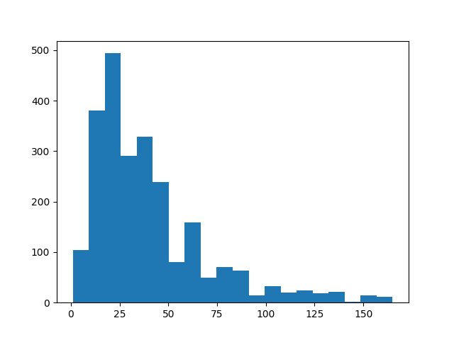
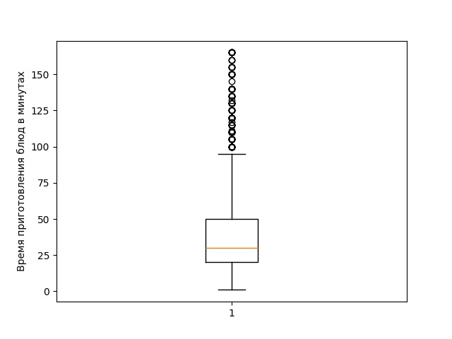
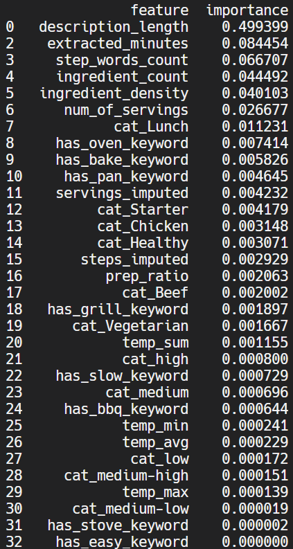
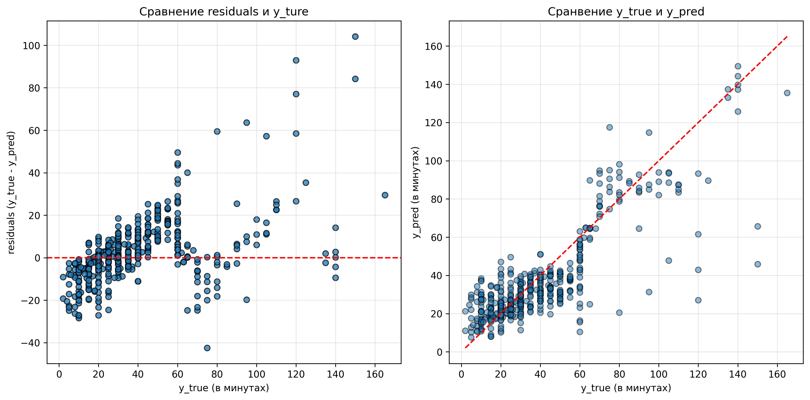

# CookingTimePredictor
## Предсказание времени приготовления блюда по названию, описанию, ингредиентам и шагам приготовления

ML-пайплайн полного цикла: от сбора данных с [кулинарного сайта](https://foodnetwork.co.uk) до обучения и тестирования модели и сохранения артефакта.


**Кратко:** Random Forest (RF) по логарифмированному таргету: **MAE 10.38 мин** (Median AE 6.92). Для блюд с временем приготовления до 1 часа более 90% предсказаний имеют ошибку в пределах 20 минут. Данные: ~2500 рецептов, спаршенных с сайта foodnetwork.co.uk. Полную документацию см. в [docs/artifacts_doc.md](docs/artifacts_doc.md).

---


## Цель
Предсказать таргет `total_time_minutes` по текстовому описанию рецепта.


## Используемые метрики
| Метрика | Зачем используется |
|---|---|
| **MAE (основная)** | Интерпретируема в минутах: "насколько реально отличаетяс время приготовления" |
| RMSE | Чувствительна к длинному правому хвосту выбросов |
| Median AE | Устойчива к выбросам |
| R^2 | Доля объясненной моделью вариации таргета |

Подробнее см. в [docs/artifacts_doc.md](docs/artifacts_doc.md).


## Данные
Готовые датасеты под задачу не подошли (мало строк, неописательные колонки, сайт вообще заблокирован), поэтому данные собраны самостоятельно с помощью парсера с кулинарного сайта foodnetwork.co.uk (суммарно около 2500 рецептов). Колонки спаршенных данных:
| Колонка | Содержание |
|---|---|
| title | название блюда |
| total_time_minutes | **таргет**: ожидаемое время приготовления |
| description | краткое описание рецепта |
| ingredients | список и количество ингредиентов |
| cooking_steps | шаги приготовления |
| num_of_servings | количество порций |
| category | категория / тег / клчевые слова |

В колонках `cooking_steps` и `num_of_servings` пропущенные занчения импутировны, а строки с пропущенным таргетом – удалены.
Важно, что в данных наблюдается сильный дисбаланс таргета: длинный правый хвост и множество выбросов (т.к. очень иного рецептов с малым временеи приготовления (до 1 часа) и очень мало – с баольшим). Модель обучается на логарифмированном таргете (в конце к предсказаниям применяется экспонента).

|  |  |
|:--:|:--:|
| Сильный дисбаланс времени пригтовления в минутах (= таргета) | Медиана лежит чуть выше 25 минут при длинном верхнем усике и множестве выбросов сверху |

Подробнее см. в [docs/artifacts_doc.md](docs/artifacts_doc.md).


## Ключевые результаты
Было проведено сравнение двух моделей: Random Forest и Gradient Boosting. Результаты работы приведены в таблице:
| Модель | MAE | RMSE | R^2 | Median AE |
|---|:--:|:--:|:--:|:--:|
| **Random Forest (выбранная)** | **10.38** | **15.82** | **0.688** | **6.92** |
| Gradient Boosting | 11.11 | 16.99 | 0.641 | 7.59 | 

Превосходство случайного леса очевидно.

Подробные таблицы метрик (включая метрики в разбиении по чанкам времени) см. в [docs/artifacts_doc.md](docs/artifacts_doc.md) (раздел "Результаты тестирования и показания метрик") и в файлах: [figures/results/rf_metric_results.png](figures/results/rf_metric_results.png) и [figures/results/gb_metric_results.png](figures/results/gb_metric_results.png).


## Пайплайн
парсинг -> предобработка и очистка данныз -> EDA и разделение (80/20) -> feature engineering + кодирование -> hyperparameter tuning (с 3-fold cross-val) -> обучение модели -> тестирование и вывод метрик -> сохранение обученной модели в models/model.joblib

Подробнее см. в [docs/artifacts_doc.md](docs/artifacts_doc.md).


## Важные уточнения
- **Валидация и утечки:** кросс-валидация – только для подбора гиперпараметров; импутация, логарифмирование и кодирование выполнялись раздельно для train и test; ни одна фича не раскрывает таргет напрямую.
- **Выбор модели:** производитлись тестирования с ансамлем: VotingRegressor из RF + линейная + KNN (результаты: MAE > 15 мин и R^2 < 0.5; поочередное исключение моделей показало превосходство RF (~12 мин даже без hyperparam tuning). Gradient Boosting обучен для сравнения – RF стабильнее, особенно на долго готовящихся блюдах.
- **Гиперпараметры:** hyperparameter tuning с 3-fold cross-val: `n_estimators=500`, `max_depth=None`, `min_samples_leaf=3`.

| > |
|:--:|
| Feature importannces |

Подробнее см. в [docs/artifacts_doc.md](docs/artifacts_doc.md).


## Анализ ошибок
- Модель склонна занижать время для блюд дольше ~80 минут (среди топ-10 ошибок почти все – занижения): следствие дисбаланса таргета.
- Остатки образуют своеобразную воронку (т.е. не имеют систематического смещения => ошибка случайна)

|  |
|:--:|
| Граифики ошибок |

Подробнее см. в [docs/artifacts_doc.md](docs/artifacts_doc.md).


## Деплой
Запускать файлы рекомендуется в последовательности:
```
python main.py
python main_preprocess.py
python main_train.py
```
Процедура парсинга сайта может занять очень много времени. Если необходимо исключитльно обучить модель и получить метрики, необходимо запустить **ТОЛЬКО** файл main_train.py (при условии, что в директории data/ доступен файл df_ready.csv). В целях экономии времени блок кода с настройкой гиперапараметров закомментрован (гиперпараметры закардкожены в RF); если требует дополнительно провести hyperparam tuning, нужно раскомментировать код.
Подробнее см. в [docs/artifacts_doc.md](docs/artifacts_doc.md).


## Структура проекта
```
cooking_time_predictor/
├── main.py               # парсинг: сбор URL + извлечение рецептов
├── main_preprocess.py    # очистка сырых логов → data/df_ready.csv
├── main_train.py         # EDA, feature engineering, тюнинг, обучение, метрики, артефакт
├── requirements.txt
├── data/                 # датасеты (сырой и готоый) и список ссылок на рецепты сайта
├── figures/
│   ├── eda_plots/        # EDA: распределение таргета, выбросы
│   └── results/          # важность признаков, остатки, метрики
├── models/
│   └── model.joblib      # обученная модель + состояние препроцессинга
├── docs/
│   └── artifacts_doc.md  # подробняа документация
└── README.md
```


## Ограничения
- **Точность снижается для блюд дольше 2 часов**: из-за дисбаланса таргета (основная масса строк – быстрые рецепты, до 1 часа), пропусках в шагах приготовления и субъективной оценки времени авторами рецептов точность модели сильно снижается для долгоготовящихся блюд
- **Переносимость на другие сайты не гарантирована**: пайплайн предполагает наличие базовых полей (шаги, порции, категория); их отсутствие или неполнота ухудшают качество предсказаний.
Подробнее см. в [docs/artifacts_doc.md](docs/artifacts_doc.md).


## Полная документация
Детали каждого этапа см. в [docs/artifacts_doc.md](docs/artifacts_doc.md).
